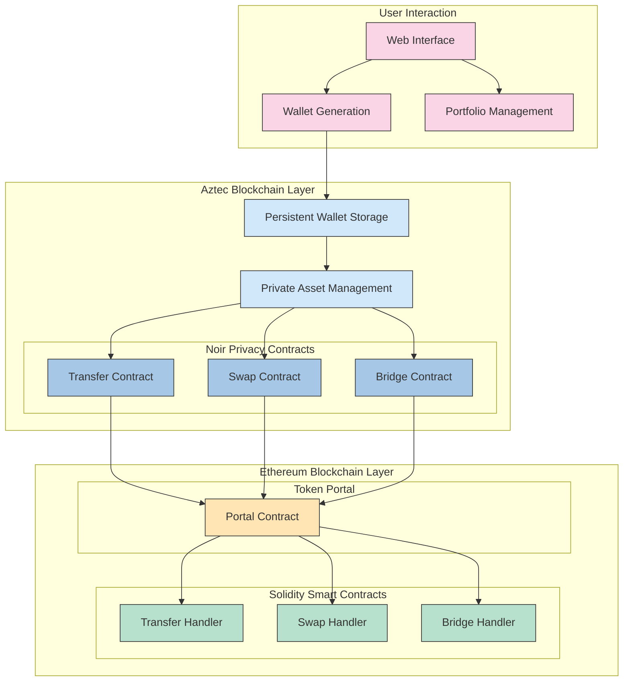

# Chameleon - Aztec + Noir privacy layer


## Overview

Chameleon is first private web-based wallet + privacy layer built with Aztec + Noir.

Current features include:

- Generating and persistent storage of Aztec wallet in the dapp
- Portfolio management for assets stores in Aztec wallet
- Private transfers of tokens from Aztec network to Ethereum
- Private swaps initiated from Aztec and executed through Uniswap on Ethereum by using token portal
- Private bridging to Ethereum using token portal



## Setup

## Aztec Sandbox

For testing you need to have Aztec Sandbox running locally.

## Dapp

- move into dapp dir `cd /dapp`
- install dependencies `pnpm i`
- start local web app with `pnpm run dev`

### Token Portal

For Aztec token portal scripts to work properly Node.js has to be set to version 20.0 which can be done using `nvm use 20`. If this specific version isn't available it can be installed using `nvm install 20`

### Uniswap Testing

To install dependencies:

```bash
bun install
```

To run:

```bash
bun run index.ts
```

This project was created using `bun init` in bun v1.1.25. [Bun](https://bun.sh) is a fast all-in-one JavaScript runtime.
